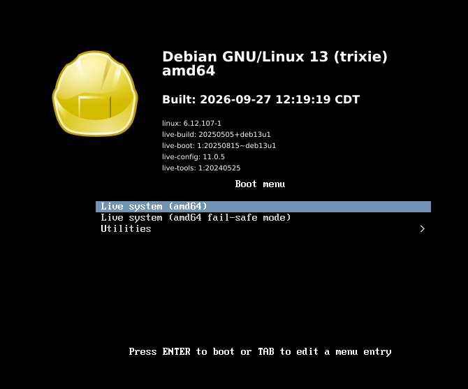
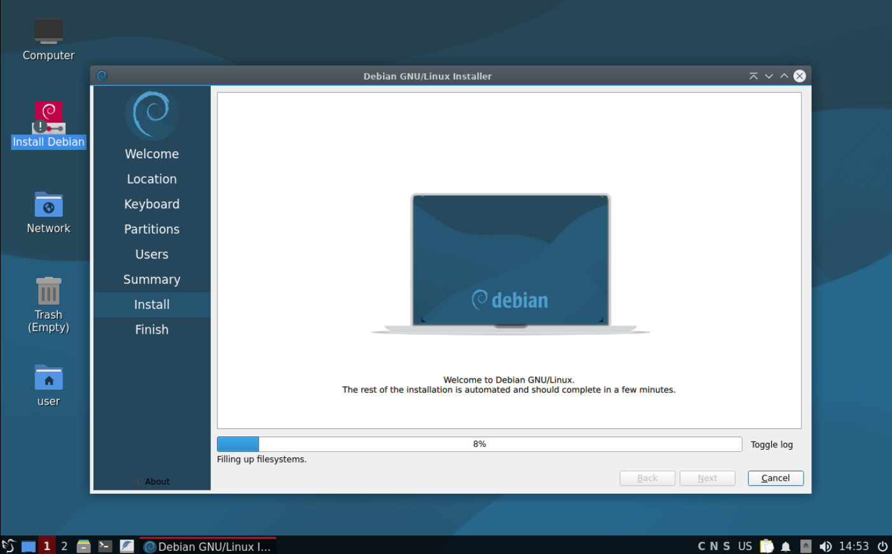

# FeatherOS

> A lightweight, fast and practical Debian-based Linux distribution.

FeatherOS is a personal Linux distribution project focused on
performance, simplicity, security, and practical everyday use.

## Why I Built FeatherOS

I'm active in cybersecurity and have a strong interest in Linux,
system administration, and low-level system concepts.

FeatherOS started with a simple question:

**Why does a desktop operating system need to feel so heavy?**

I wanted to build something fast to install, quick to boot,
lightweight, and free from software I don't actually need.

My early experiments with Linux and cybersecurity were done on
an old Lenovo G5080. It wasn't exactly a powerful machine —
sometimes it took nearly two hours just to get a VM running. :)

FeatherOS is the result of taking that curiosity one step further:
building, testing, breaking, and improving my own Linux distribution.

---

## Screenshots

### Boot Screen

### Install

## FeatherOS 1.2

### Base System

- Debian 13 (Trixie)
- amd64
- systemd
- Secure APT

### Desktop

- LXQt
- LightDM
- NetworkManager

### Installation

- Calamares graphical installer
- Bootable hybrid ISO
- Tested with VMware and VirtualBox

### FeatherOS Guide

A built-in graphical guide covering:

- Linux basics
- Programming
- Cybersecurity
- Gaming
- Design & Multimedia
- Student tools
- Engineering
- Medical
- Server & DevOps
- Productivity
- Science & Research

### Automatic Updates

FeatherOS includes a daily system update service using
a systemd timer.

It performs:

- `apt update`
- `apt upgrade`
- `apt autoremove`

The update service has been tested successfully on an installed
FeatherOS system.

---

## Performance

FeatherOS is designed with a focus on:

- Fast boot
- Low memory usage
- Minimal unnecessary services
- Responsive desktop experience

Initial testing on the installed system achieved approximately:

- **7.3 seconds** total systemd startup time
- **~615 MiB RAM** usage

These numbers are development benchmarks and depend on the
hardware and virtualization environment.

---

## Security Approach

FeatherOS follows a practical security baseline without adding
unnecessary overhead.

The current approach includes:

- Debian Stable as the foundation
- Secure APT package management
- Automatic daily updates
- Minimal unnecessary services
- Security tools available through the FeatherOS Guide

The goal is to improve the security baseline while keeping the
system lightweight and usable.

---

## Design Philosophy

FeatherOS aims to be:

- Lightweight
- Fast
- Stable
- Practical
- Easy to install
- Easy to understand

---

## Roadmap

### 1.2

- [x] Debian 13 base
- [x] LXQt desktop
- [x] Calamares installer
- [x] FeatherOS Guide
- [x] Automatic daily updates
- [x] VMware testing
- [x] VirtualBox testing

---

## Project Status

FeatherOS is an independent development project and is currently
under active development and testing.

The project is mainly a practical exploration of Linux system
construction, configuration, performance, and security.

---

## License

No license has been selected yet. 🤷‍♂️

## Download

[FeatherOS 1.2 — Release](https://github.com/navidnategh/FeatherOS/releases/tag/v1.2.0)
